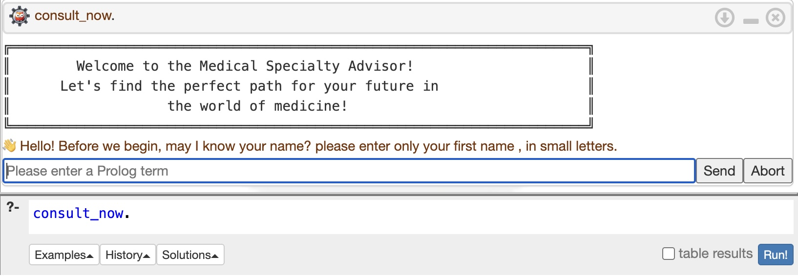
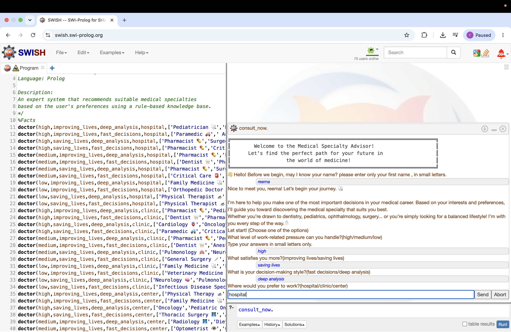
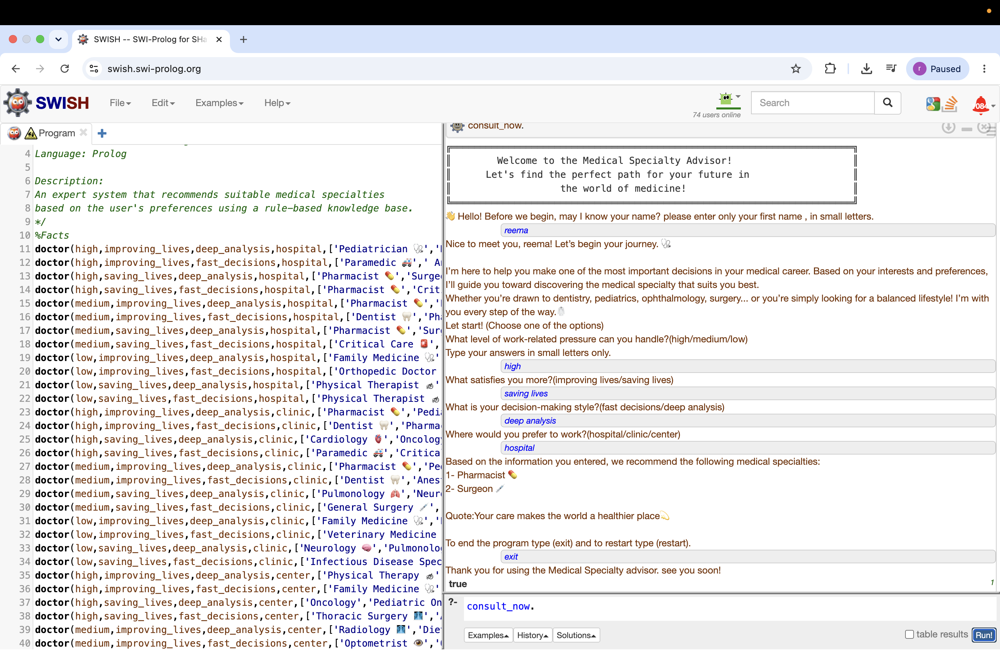

# Medical Specialty Advisor

A simple expert system developed in Prolog that recommends medical specialties based on a user's preferences.

The program asks the user a series of questions about work pressure, career goals, decision-making style, and preferred workplace. Based on the answers, it suggests two medical specialties from a predefined knowledge base.

## Features

- Recommends medical specialties based on user input
- Interactive command-line interface
- Input validation
- Random motivational quote after each recommendation
- Option to restart or exit the program

## Built With

- Prolog
- SWI-Prolog

## How to Run

1. Install SWI-Prolog.
2. Open the file `medical_specialty_advisor.pl`.
3. Run the following query:
consult_now.

4. Answer the questions displayed on the screen.
5. The program will recommend two medical specialties based on your answers.

## Screenshots

### Welcome Screen

### Questions

### Recommendation

## Team Members

- Reema Fayez Almutairi
- Abeer Ali Alsuhibani
- Sarah Ahmed Alsuhibani
- Rama Mutaz Sumrein
- Raghad Ahmed Alabbad
